# K8s-based ML Service Deployment on a Single Machine

This is a demonstration of deploying a machine learning service on Kubernetes using a single machine, such as a MacBook.

## Overview

This example consists of the following parts:

1. Building and training a neural network using Keras + TensorFlow for the [KMNIST dataset](https://codh.rois.ac.jp/kmnist/index.html.en).
2. Deploying the trained neural network as an online ML service in a Kubernetes cluster (using Minikube for single-machine deployment). Redis is used to ensure scalability, parallelism, and high availability.
3. Providing a UI for demonstration, allowing graphical interaction with the system, displaying system status, and performance metrics.

### Technology Stack

- **Training:** Python, Keras, TensorFlow
- **Deployment:** Docker, Kubernetes, Redis
- **UI:** Node.js, React

### Architecture Diagram

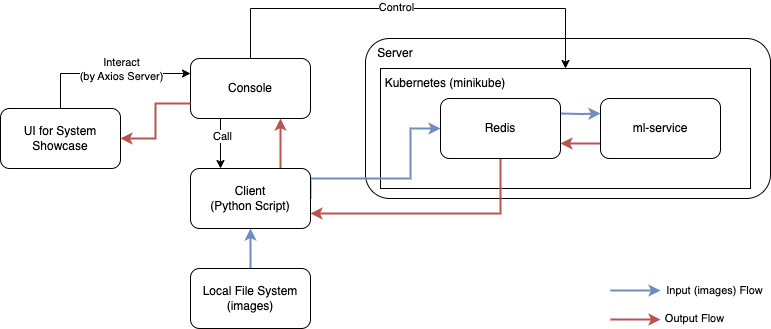

- [K8s-based ML Service Deployment on a Single Machine](#k8s-based-ml-service-deployment-on-a-single-machine)
  - [Overview](#overview)
    - [Technology Stack](#technology-stack)
    - [Architecture Diagram](#architecture-diagram)
  - [1. Neural Network Training](#1-neural-network-training)
    - [1.1 File Structure](#11-file-structure)
    - [1.2 Environment Setup](#12-environment-setup)
    - [1.3 Training](#13-training)
  - [2. Service Deployment](#2-service-deployment)
    - [2.1 File Structure](#21-file-structure)
    - [2.2 Deployment Steps](#22-deployment-steps)
  - [3. Service Demonstration](#3-service-demonstration)
    - [3.1 File Structure](#31-file-structure)
    - [3.2 Setup](#32-setup)
    - [3.3 Demonstration](#33-demonstration)
      - [3.3.1 UI Layout](#331-ui-layout)
      - [3.3.2 Demonstration Process](#332-demonstration-process)
  - [4. Enhancements](#4-enhancements)
    - [4.1 Monitoring with Prometheus + Grafana](#41-monitoring-with-prometheus--grafana)
    - [4.2 Auto-scaling with Keda](#42-auto-scaling-with-keda)


## 1. Neural Network Training

### 1.1 File Structure

- `train/checkpoints`: Stores all checkpoints generated by `train_model.ipynb`. It is untracked by the Git so please download it [here](https://drive.google.com/file/d/1dwDDKNOOLfX9rvgXZHxCyxckcz4MJZDW/view?usp=drive_link). 
- `train/data`: Contains the [KMNIST dataset](https://codh.rois.ac.jp/kmnist/index.html.en). It is untracked by the Git so please download it [here](https://drive.google.com/file/d/1SDtOLCOu9yF2pci6GxXSgGIL9ma4ZmOK/view?usp=drive_link). 
- `train/requirements.txt`, `train/requirements_cpu.txt`: Python dependencies for training.
- `train/train_model.ipynb`: Notebook containing analysis and training process.

### 1.2 Environment Setup

1. Download and install Anaconda: [Anaconda Download](https://www.anaconda.com/products/distribution)
2. Create a virtual environment with Python 3.11.5:
   ```sh
   conda create -n KMNIST python=3.11.5
   ```
3. Activate the environment:
   ```sh
   conda activate KMNIST
   ```
4. Install dependencies:
   - If GPU is available:
     ```sh
     pip install -r train/requirements.txt
     ```
   - If no GPU:
     ```sh
     pip install -r train/requirements_cpu.txt
     ```

### 1.3 Training

Open `train/train_model.ipynb`, select the KMNIST virtual environment as the kernel, and run the cells step by step.

## 2. Service Deployment

### 2.1 File Structure

- `server/start_server.py`: ML service script that loads checkpoints and processes images from Redis.
- `server/Dockerfile`: Dockerfile for containerizing the ML service.
- `server/ml-service`: Helm chart for deploying the ML service in Kubernetes.
- `server/requirements.txt`: Python dependencies for running the ML service.
- `server/checkpoints`: Stores trained model checkpoints. It is untracked by the Git so please download it [here](https://drive.google.com/file/d/1o_bj7udNOLp2J-PMxDUmCso1LtozAs_G/view?usp=drive_link). 
- `server/redis`: Helm chart for deploying Redis in Kubernetes.

### 2.2 Deployment Steps

1. Copy checkpoints from `train/checkpoints` to `server/checkpoints` and update `CHECKPOINT_HASH` in `server/start_server.py`.
2. Install and start Docker: [Docker Documentation](https://docs.docker.com/desktop/)
3. Start Minikube:
   ```sh
   minikube start
   ```
4. Install Helm: [Helm Documentation](https://helm.sh/docs/intro/install/)
5. Navigate to the server directory:
   ```sh
   cd server
   ```
6. Deploy Redis with Helm:
   ```sh
   helm install my-redis ./redis
   ```
7. Build the Docker image:
   ```sh
   docker build -t ml-service:v1.0 .
   ```
8. Load the Docker image into Minikube:
   ```sh
   minikube image load ml-service:v1.0
   ```
9. Deploy the ML service with Helm:
   ```sh
   helm install ml-service ./ml-service
   ```

## 3. Service Demonstration

### 3.1 File Structure

- `visualization/imgs`: Sample images for testing. It is untracked by the Git so please download it [here](https://drive.google.com/file/d/1C4ozJkvQciQybh7zPX9uPB8BWX8YboxU/view?usp=drive_link). 
- `visualization/axios_server.js`: Axios server for UI-console interactions.
- `visualization/requirements.txt`: Python dependencies for `client.py`.
- `visualization/client.py`: Sends test images to Redis and retrieves results.
- `visualization/src/MLServiceDemo.jsx` & `visualization/src/MLServiceDemo.css`: Main UI files.

### 3.2 Setup

1. Create a virtual environment:
   ```sh
   conda create -n KMNISTUI python=3.11.5
   ```
2. Activate the environment:
   ```sh
   conda activate KMNISTUI
   ```
3. Install dependencies:
   ```sh
   pip install -r visualization/requirements.txt
   ```
4. Install Node.js: [Node.js Download](https://nodejs.org/en/download)
5. Navigate to the `visualization` directory:
   ```sh
   cd visualization
   ```
6. Install Node.js dependencies:
   ```sh
   npm install .
   ```
7. Start the Axios server:
   ```sh
   node axios_server.js
   ```
8. Open another terminal and expose Redis service:
   ```sh
   minikube service my-redis-master
   ```
9. Update `visualization/client.py` with the correct Redis port.
10. Start the UI:
    ```sh
    npm start
    ```

### 3.3 Demonstration  

#### 3.3.1 UI Layout  

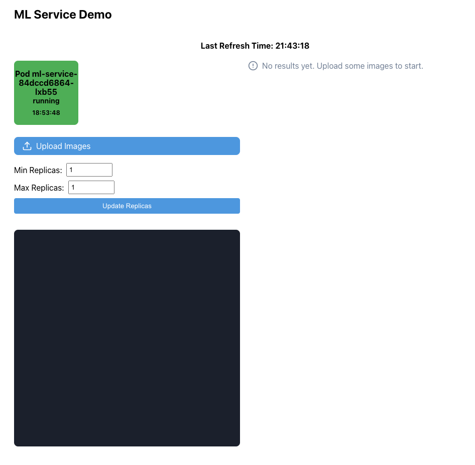  

* Every time the UI refreshes, it executes the `kubectl get pods` command in the background via an Axios server to retrieve the status of all pods associated with `ml-service`.  
* Pods are listed in the top-left corner. Green pods have successfully connected to Redis and can function normally, while red pods are still initializing. Clicking on a pod allows you to shut it down, simulating a service failure.  
* Clicking the **Upload Images** button opens the file selection view, allowing you to choose and upload images for recognition (e.g., images prepared in the `visualization/imgs` folder). Multiple images can be uploaded at once.  
* By modifying **Min Replicas** and **Max Replicas** and clicking **Update Replicas**, the Helm HPA parameters will be updated, adjusting the number of pods. If there are no messages in Redis, the number of pods will decrease to **Min Replicas**; if messages exist, the number of pods will increase up to **Max Replicas**.  
* The bottom-left console panel displays all commands executed in the background during graphical interactions. It also shows performance metrics for each processing task.  
* The right panel displays the recognition results.  

#### 3.3.2 Demonstration Process  

1. Click **Upload Image** and upload `visualization/imgs/sample_0.jpg`. This image is recognized as "お", with a processing time of 2081ms, handled by the only running pod.  

   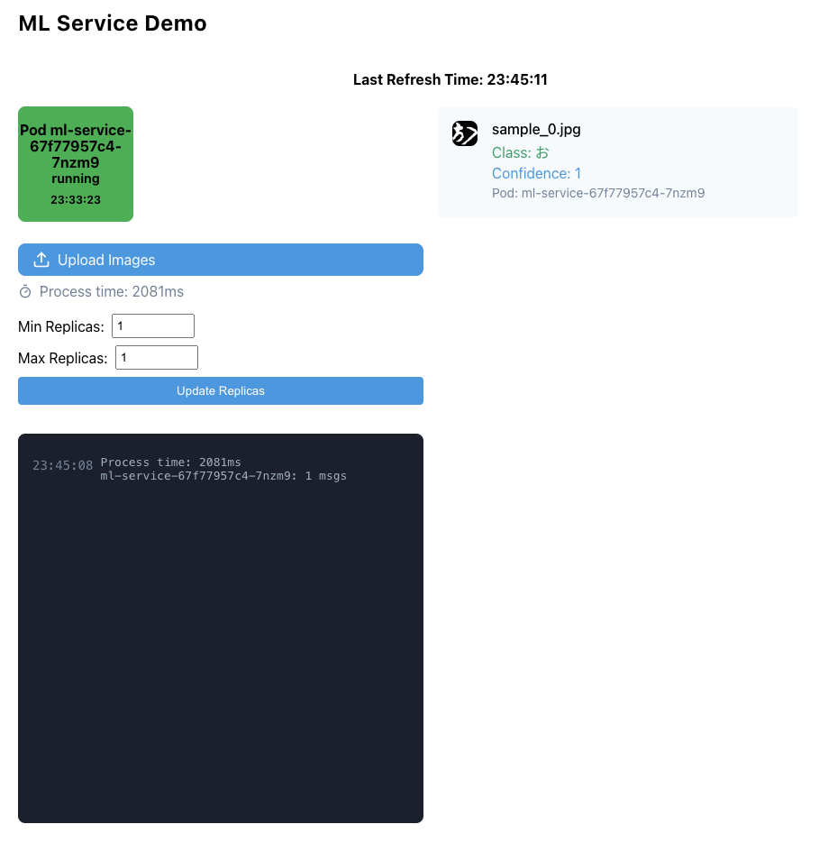  

2. Click **Upload Image** and upload images from `sample_0` to `sample_20`, a total of 21 images. The processing time is significantly longer compared to uploading a single image.  

   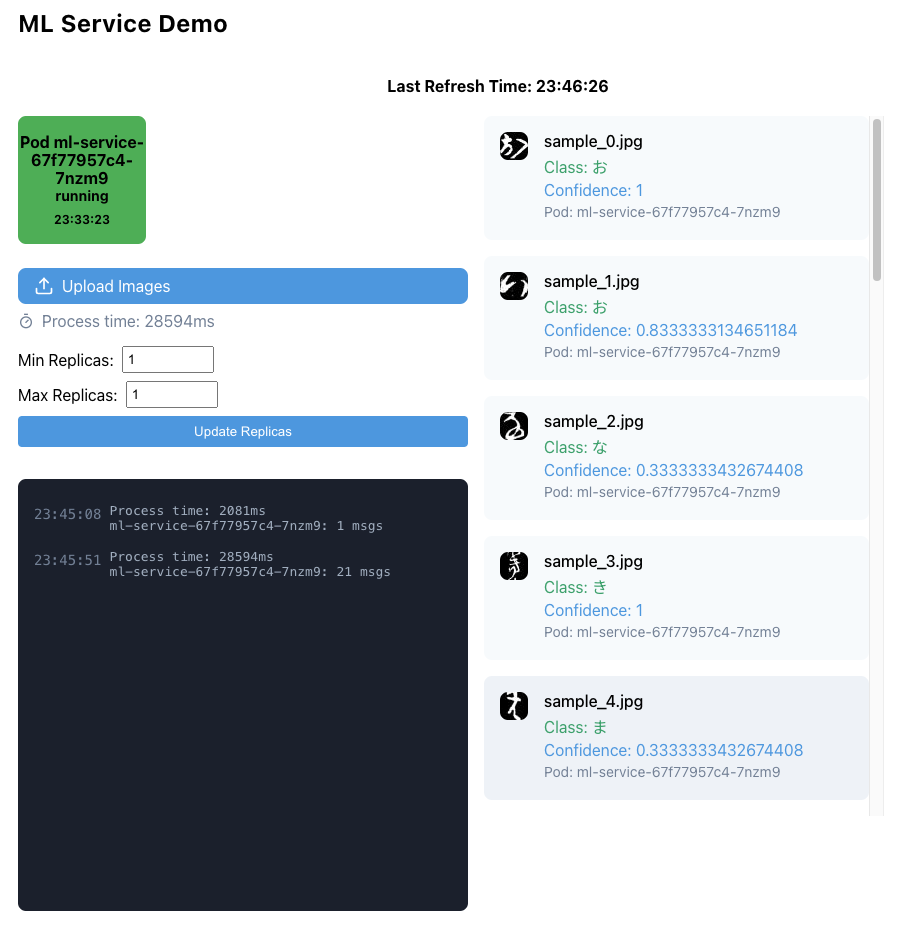  

To better deploy this service, our goal is to achieve three key objectives: **scalability, parallel processing, and high availability**. Currently, we have only one user and one service. This setup has two major issues:  

- When multiple images are uploaded at once, the service processes them sequentially, leading to slow performance.  
- If the server hosting the service goes down, the entire service becomes unavailable.  

We aim to address these issues by:  

- Running multiple instances of the service that can be automatically replicated.  
- Deploying each instance on a different server.  
- Implementing a **load balancer** to distribute traffic automatically.  

We leverage **Kubernetes (k8s)** to flexibly scale our services. To implement load balancing, we deploy **Redis** in the k8s cluster. Redis serves as a **message queue**, where services pull messages for processing and acknowledge completion, causing Redis to remove processed messages from the queue. Similarly, recognition results are stored in Redis, and once consumed, they are removed.  

This architecture ensures that:  

- **Multiple services can fetch and process messages simultaneously**, enabling parallel execution.  
- **If one service instance fails, others continue processing**, ensuring high availability.  

1. **Increase min and max replicas to 2**, then click **Update Replicas** to increase the number of pods.  

   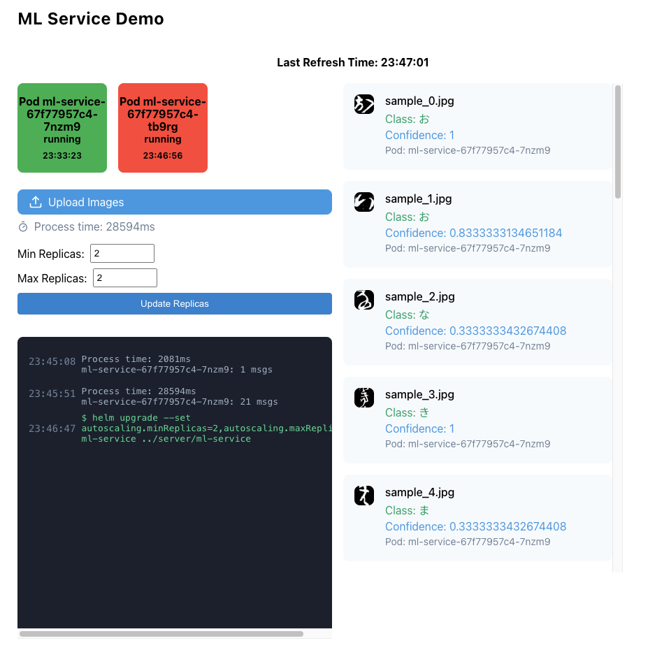  

   Then, click **Upload Image** and upload images from `sample_0` to `sample_20`. This time, the processing time is significantly reduced, as two service instances share the workload.  

   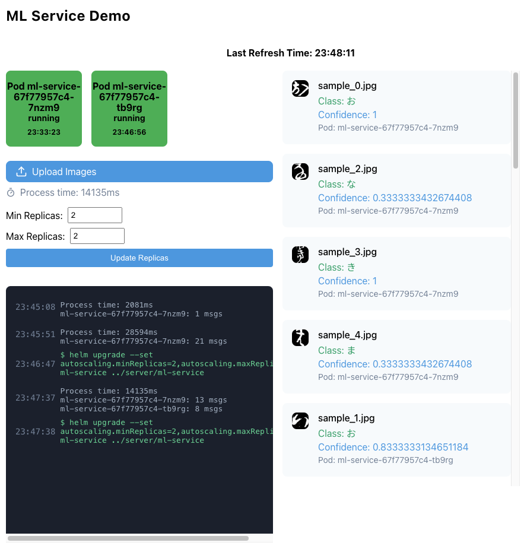  

2. **Simulating a service failure**:  

   - Click **Upload Image** and upload images from `sample_0` to `sample_20`.  
   - During processing, click on one pod to shut it down, simulating a failure.  
   - Since the **HPA Min Replicas is set to 2**, Kubernetes ensures that the number of pods does not drop below 2, so it automatically starts a new pod.  

   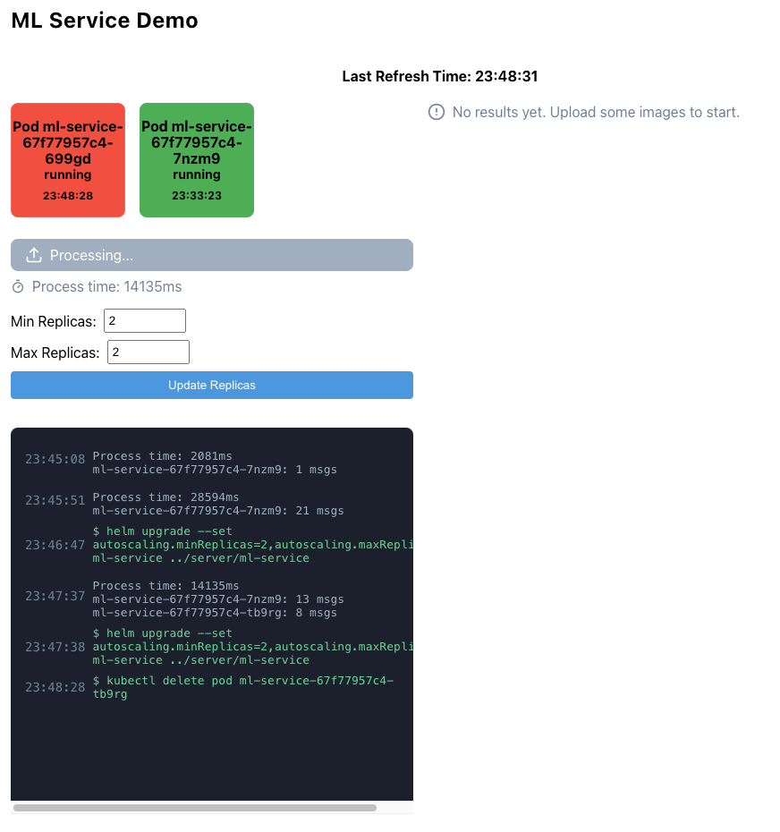  

   - The remaining active pod continues processing images.  
   - The new pod starts processing as soon as it becomes ready.  
   - After processing, we can see that **all three pods participated**, and during the downtime, the remaining pod handled the workload.  

   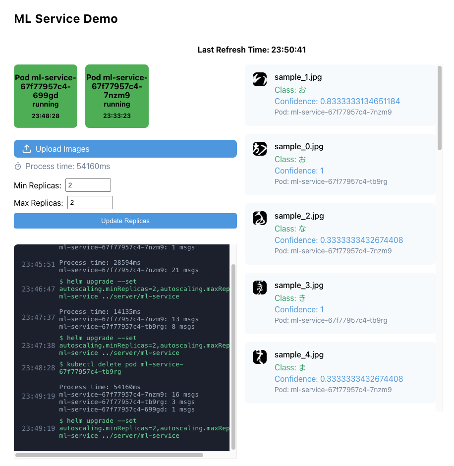  

3. **Optimizing resource usage**:  

   To reduce costs, we may want to shut down some servers when there are no requests.  

   - Set **Min Replicas and Max Replicas to 1** to scale down.  

     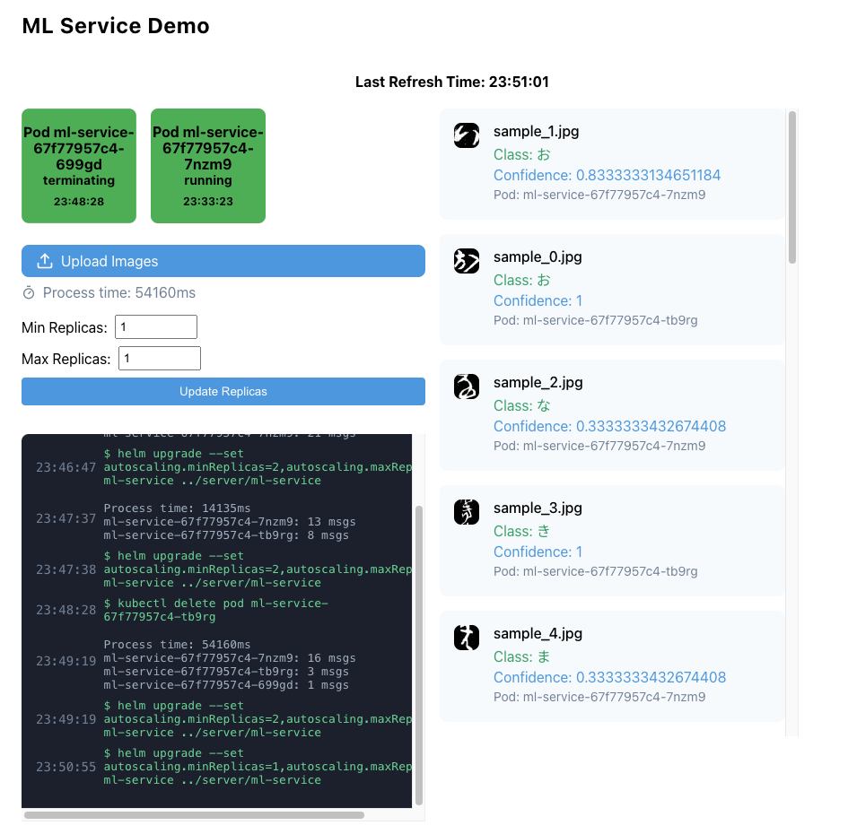  

   - Keep **Min Replicas at 1** and increase **Max Replicas to 2**.  
   - Upload images again; an additional pod is automatically created to handle the increased workload.  

     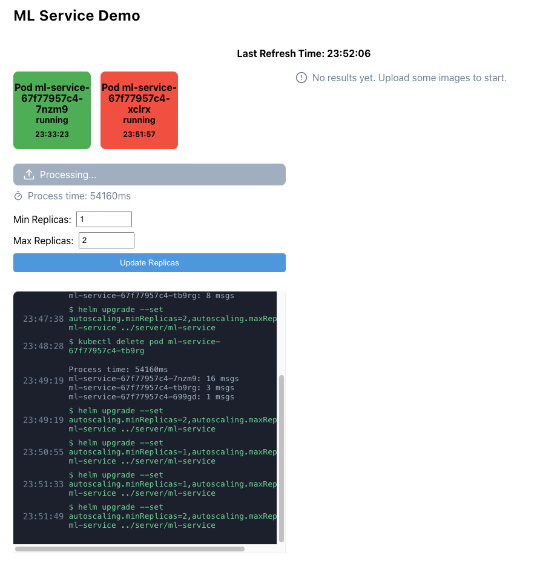  
     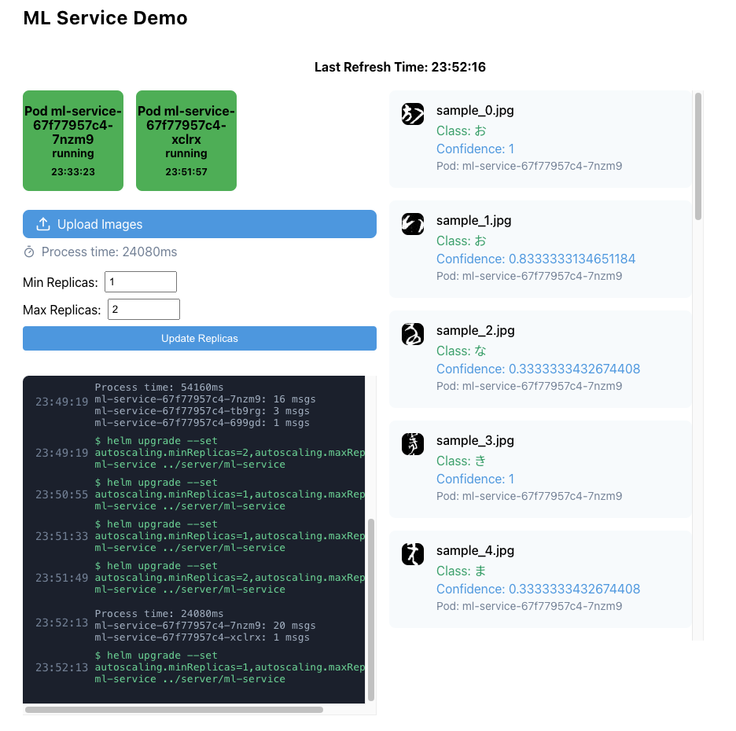  

   - Once processing is completed, the additional pod is automatically shut down.  

     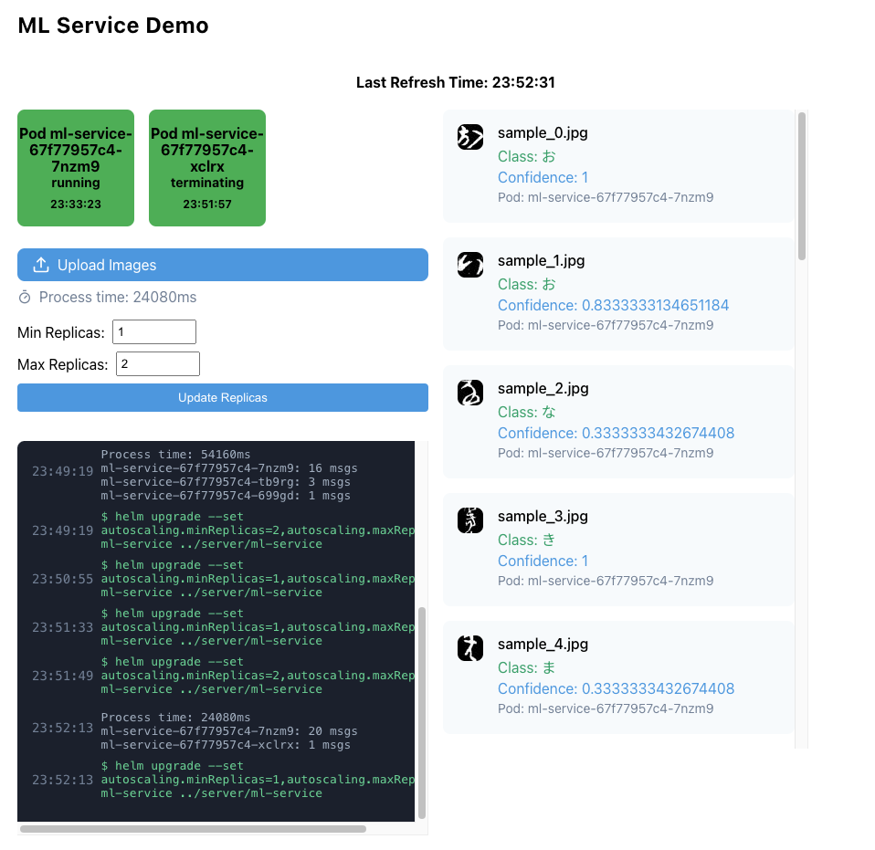  

In this demonstration, we manually adjusted HPA parameters via **Helm**, which is a basic approach. In a production environment, **KEDA** can be used for **automatic scaling**, which will be discussed in the next section.


## 4. Enhancements

### 4.1 Monitoring with Prometheus + Grafana

1. Install Prometheus + Grafana:
   ```sh
   helm repo add prometheus-community https://prometheus-community.github.io/helm-charts
   helm install monitoring prometheus-community/kube-prometheus-stack \
     --set prometheus.prometheusSpec.resources.requests.memory=512Mi \
     --set grafana.resources.requests.memory=256Mi
   ```

2. Enable monitoring in `server/ml-service/values.yaml`.

3. Upgrade the ML service:
   ```sh
   helm upgrade ml-service ./ml-service
   ```

4. Expose Grafana:
   ```sh
   minikube service monitoring-grafana
   ```

5. Log into Grafana (default: `admin` / `prom-operator`) and set up dashboards.

6. Select the data source as Prometheus and add the panels you need. For example, we added a panel that can monitor the total number of pods and the number of **ready** pods for the ml-service.

   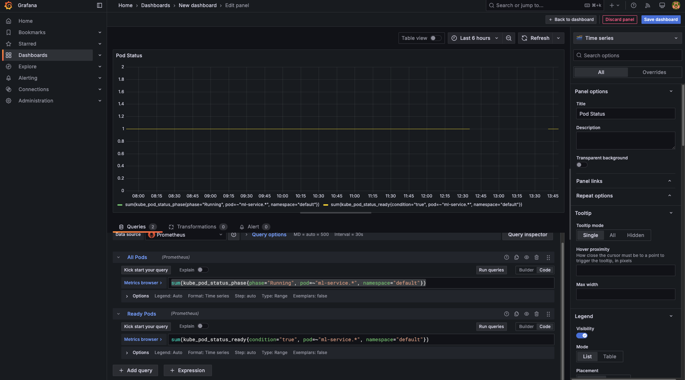

### 4.2 Auto-scaling with Keda

1. Install Keda:
   ```sh
   helm repo add kedacore https://kedacore.github.io/charts
   helm repo update
   helm install keda kedacore/keda
   ```
2. Enable Keda in `server/ml-service/values.yaml` and disable HPA autoscaling.
3. Upgrade the ML service:
   ```sh
   helm upgrade ml-service ./ml-service
   ```

